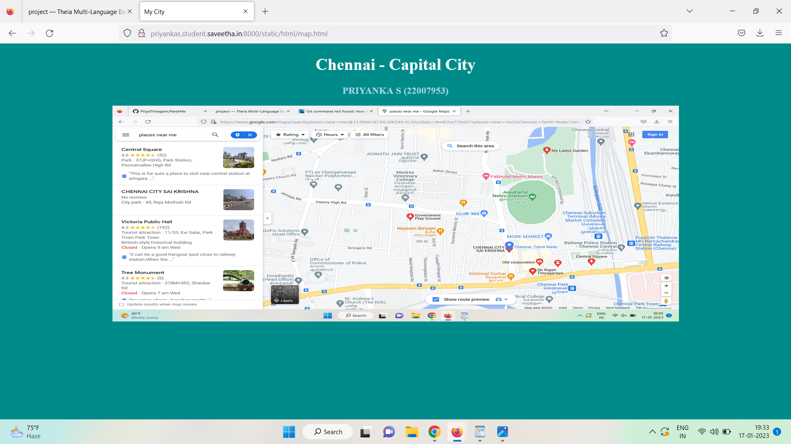
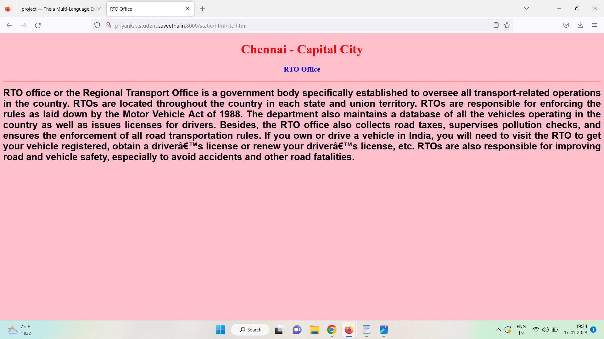
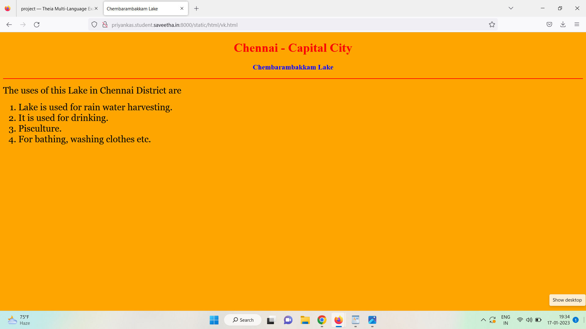
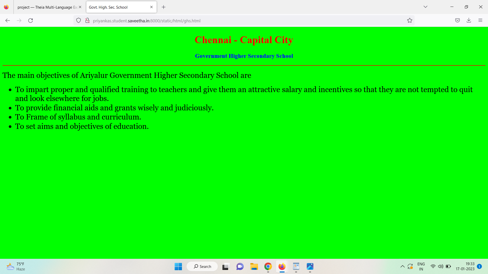
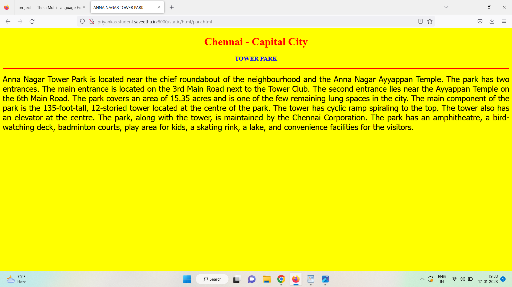
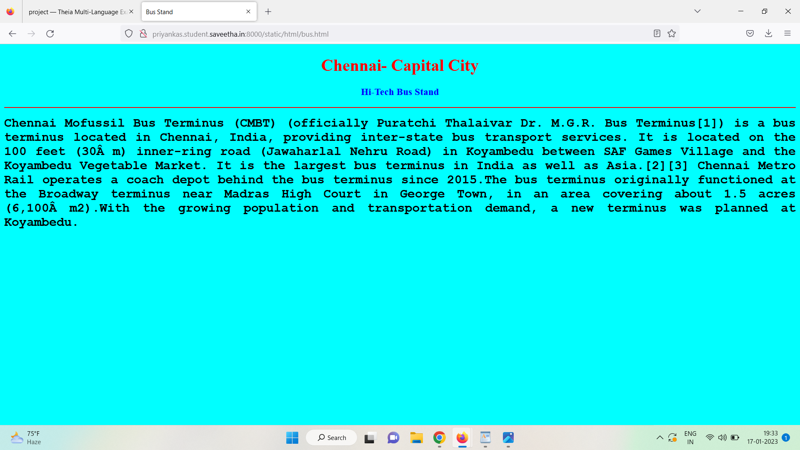
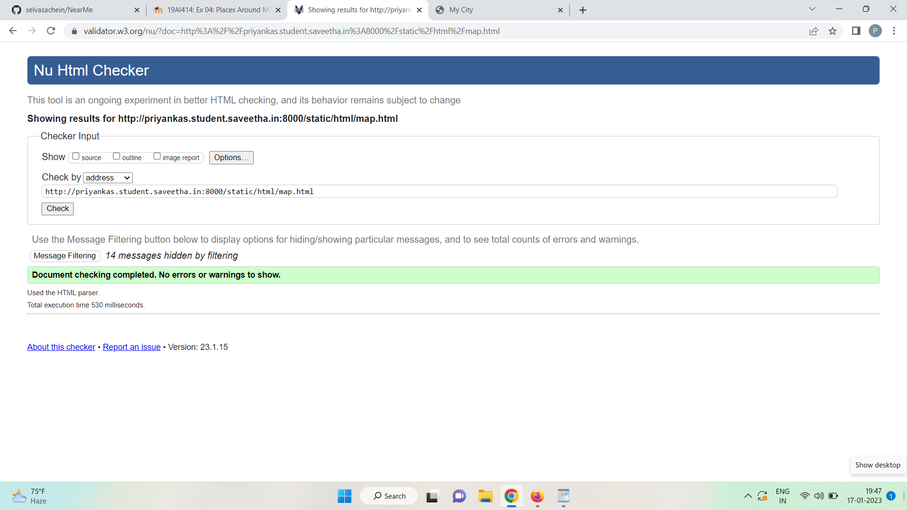

# Places Around Me
## AIM:
To develop a website to display details about the places around my house.

## Design Steps:

### Step 1:
Clone the github repository into Theia IDE.
### Step 2:
Create a new Django project
### Step 3:
Write the needed HTML Code.
### Step 4:
Run the Django server and execute the HTML files.

## Code:
```

map.html

<!DOCTYPE html>
<html lang="en">
<head>
<title>My City</title>
<style>
    *{
        background-color: darkcyan;
    }
</style>
</head>
<body>
<h1 align="center">
<font color="white"><b>Chennai - Capital City</b></font>
</h1>
<h3 align="center">
<font color="lightblue"><b>PRIYANKA S (22007953)</b></font>
</h3>
<center>

<map name="MyCity">
<area shape="circle" coords="190,50,20" href="/static/html/ghs.html" title="Govt. Higher Secondary School">
<area shape="rectangle" coords="230,30,260,60" href="/static/html/rto.html" title="RTO Office">
<area shape="circle" coords="400,350,50" href="/static/html/vk.html" title="Washerman's Lake">
<area shape="circle" coords="400,200,75" href="/static/html/bus.html" title="Hi-Tech Bus Stand">
<area shape="rectangle" coords="490,150,870,320" href="/static/html/park.html" title="Eco-Park">
</map>
</center>
</body>
</html>

bus.html

<!DOCTYPE html>
<html lang="en">
<head>
<title>Bus Stand</title>
</head>
<body bgcolor="cyan">
<h1 align="center">
<font color="red"><b>Chennai- Capital City</b></font>
</h1>
<h3 align="center">
<font color="blue"><b>Hi-Tech Bus Stand</b></font>
</h3>
<hr size="3" color="red">
<p align="justify">
<font face="Courier New" size="5">
<b>
    Chennai Mofussil Bus Terminus (CMBT) (officially Puratchi Thalaivar Dr. M.G.R. Bus Terminus[1]) is a bus terminus located in Chennai, India, providing inter-state bus transport services. It is located on the 100 feet (30 m) inner-ring road (Jawaharlal Nehru Road) in Koyambedu between SAF Games Village and the Koyambedu Vegetable Market. It is the largest bus terminus in India as well as Asia.[2][3] Chennai Metro Rail operates a coach depot behind the bus terminus since 2015.The bus terminus originally functioned at the Broadway terminus near Madras High Court in George Town, in an area covering about 1.5 acres (6,100 m2).With the growing population and transportation demand, a new terminus was planned at Koyambedu.
</b>
</font>
</p>
</body>
</html>

rto.html

<!DOCTYPE html>
<html lang="en">
<head>
<title>RTO Office</title>
</head>
<body bgcolor="pink">
<h1 align="center">
<font color="red"><b>Chennai - Capital City</b></font>
</h1>
<h3 align="center">
<font color="blue"><b>RTO Office</b></font>
</h3>
<hr size="3" color="red">
<p align="justify">
<font face="Arial" size="5">
<b>
RTO office or the Regional Transport Office is a government body specifically established to oversee all transport-related operations in the country. RTOs are located throughout the country in each state and union territory. RTOs are responsible for enforcing the rules as laid down by the Motor Vehicle Act of 1988.
The department also maintains a database of all the vehicles operating in the country as well as issues licenses for drivers. Besides, the RTO office also collects road taxes, supervises pollution checks, and ensures the enforcement of all road transportation rules. If you own or drive a vehicle in India, you will need to visit the RTO to get your vehicle registered, obtain a driver’s license or renew your driver’s license, etc.
RTOs are also responsible for improving road and vehicle safety, especially to avoid accidents and other road fatalities.
</b>
</font>
</p>
</body>
</html>

ghs.html

<!DOCTYPE html>
<html lang="en">
<head>
<title>Govt. High. Sec. School</title>
</head>
<body bgcolor="lime">
<h1 align="center">
<font color="red"><b>Chennai - Capital City</b></font>
</h1>
<h3 align="center">
<font color="blue"><b>Government Higher Secondary School</b></font>
</h3>
<hr size="3" color="red">
<p align="justify">
<font face="Georgia" size="5">
The main objectives of Ariyalur Government Higher Secondary School are 
<ul>
<li>To impart proper and qualified training to teachers and give them an attractive salary and incentives so that they are not tempted to quit and look elsewhere for jobs.</li>
<li>To provide financial aids and grants wisely and judiciously.</li>
<li>To Frame of syllabus and curriculum.</li>
<li>To set aims and objectives of education.</li>
</ul>
</font>
</p>
</body>
</html>

park.html

<!DOCTYPE html>
<html lang="en">
<head>
<title>ANNA NAGAR TOWER PARK</title>
</head>
<body bgcolor="yellow">
<h1 align="center">
<font color="red"><b>Chennai - Capital City</b></font>
</h1>
<h3 align="center">
<font color="blue"><b>TOWER PARK</b></font>
</h3>
<hr size="3" color="red">
<p align="justify">
<font face="Tahoma" size="5">
    Anna Nagar Tower Park is located near the chief roundabout of the neighbourhood and the Anna Nagar Ayyappan Temple. The park has two entrances. The main entrance is located on the 3rd Main Road next to the Tower Club. The second entrance lies near the Ayyappan Temple on the 6th Main Road. The park covers an area of 15.35 acres and is one of the few remaining lung spaces in the city. The main component of the park is the 135-foot-tall, 12-storied tower located at the centre of the park. The tower has cyclic ramp spiraling to the top. The tower also has an elevator at the centre. The park, along with the tower, is maintained by the Chennai Corporation. The park has an amphitheatre, a bird-watching deck, badminton courts, play area for kids, a skating rink, a lake, and convenience facilities for the visitors. 
</font>
</p>
</body>
</html>

vk.html

<!DOCTYPE html>
<html lang="en">
<head>
<title>Chembarambakkam Lake</title>
</head>
<body bgcolor="orange">
<h1 align="center">
<font color="red"><b>Chennai - Capital City</b></font>
</h1>
<h3 align="center">
<font color="blue"><b>Chembarambakkam Lake</b></font>
</h3>
<hr size="3" color="red">
<p align="justify">
<font face="Georgia" size="5">
The uses of this Lake in Chennai District are 
<ol type="1">
<li>Lake is used for rain water harvesting.</li>
<li>It is used for drinking.</li>
<li>Pisculture.</li>
<li>For bathing, washing clothes etc.</li>
</ol>
</font>
</p>
</body>
</html>

```

## Output:













## HTML Validatpr



## Result:

The program for implementing image map is executed successfully.

